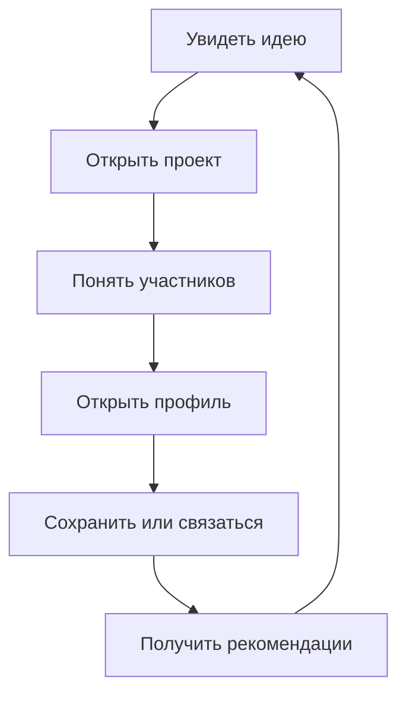
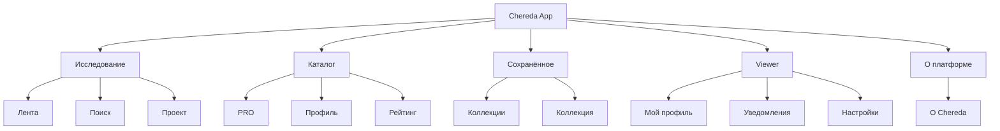
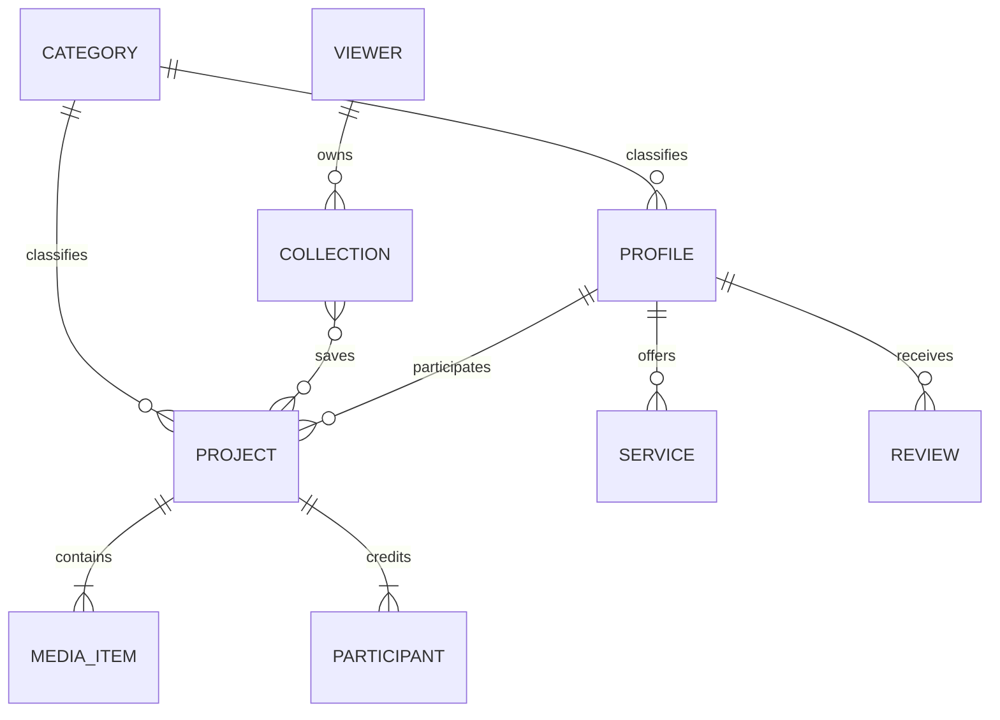

# CHEREDA — КАРТА САЙТА, МАРШРУТЫ И UX-АРХИТЕКТУРА ДЕМО

**Версия:** 1.0  
**Дата:** 18.09.2026  
**Статус:** утверждённая информационная архитектура investor demo  
**Связанный документ:** `CHEREDA_DESIGN_SYSTEM.md`  
**Текущий scope:** одна роль — Viewer, человек, который ищет и смотрит контент.

---

## 0. Назначение документа

Этот файл фиксирует:

- границы первой демонстрационной версии;
- карту сайта и URL-маршруты;
- глобальную навигацию;
- состав каждой страницы;
- связи между страницами;
- сценарии Viewer;
- состояния интерфейса;
- структуру демонстрационных данных;
- архитектуру investor demo;
- критерии UX-готовности.

Этот файл пока не определяет стек, структуру репозитория, API, БД и master prompt для Codex. Они будут созданы следующим этапом.

---

## 1. Главная цель демо

Investor demo должно за 5–7 минут доказать:

1. В Chereda удобно исследовать event-контент.
2. Подрядчика или площадку можно найти быстрее, чем через разрозненные сайты и соцсети.
3. Один проект связывает всех участников и превращает портфолио в профессиональный граф.
4. Платформа персонализирует выдачу и объясняет рекомендации.
5. Рейтинг, отзывы и верификация помогают принимать решение.

Демо не пытается одновременно изображать маркетплейс, CRM, платежи, полноценный AI и социальную сеть.

### 1.1. Главный продуктовый цикл



Этот цикл работает из ленты, поиска, PRO-каталога, рейтинга, коллекции и прямой ссылки.

---

## 2. Одна роль: Viewer

### 2.1. Кто это

Viewer:

- ищет идеи для мероприятия;
- изучает проекты и исполнителей;
- сравнивает профессионалов;
- сохраняет понравившиеся материалы;
- подписывается на профили;
- смотрит рейтинг и отзывы;
- открывает контакты;
- получает персональные рекомендации.

В demo Viewer уже вошёл и прошёл минимальную персонализацию.

### 2.2. Viewer может

- Смотреть ленту.
- Переключать «Для вас / Популярное / Новое».
- Искать по тексту.
- Применять фильтры и сортировку.
- Менять город.
- Открывать категории.
- Смотреть проект и его галерею.
- Открывать участников проекта.
- Смотреть услуги, кейсы и отзывы профиля.
- Ставить реакцию.
- Сохранять в коллекцию.
- Создавать коллекцию.
- Подписываться.
- Делиться ссылкой.
- Открывать контакты профиля.
- Смотреть рейтинг.
- Переключать тему.
- Менять интересы.

### 2.3. Viewer пока не может

- Создавать профессиональный профиль.
- Публиковать или редактировать проект.
- Загружать фото и видео.
- Приглашать соавторов.
- Покупать PRO.
- Оплачивать или бронировать услуги.
- Пользоваться внутренним чатом.
- Отправлять коммерческое предложение.
- Видеть B2B-аналитику.
- Модерировать контент.
- Пользоваться админкой.

### 2.4. Demo Viewer

При запуске создаётся преднастроенный вымышленный пользователь:

- город: Москва;
- интересы: площадки, декор, фото и видео, ведущие;
- 3–5 коллекций;
- 6–10 подписок;
- несколько просмотренных проектов;
- включённая персонализация.

Отдельного login-flow нет.

---

## 3. Scope investor demo

### 3.1. Входит

- App shell.
- Лента.
- Поиск до и после запроса.
- Фильтры и сортировка.
- PRO-каталог.
- Категорийная выдача.
- Профессиональный профиль.
- Карточка проекта/кейса.
- Медиа-галерея.
- Коллекции.
- Рейтинг.
- Viewer-профиль.
- Уведомления.
- Настройки.
- Light/dark.
- Mobile navigation.
- Loading, empty, error, no-results и 404.
- Служебный demo-hub.

### 3.2. Не входит

- Маркетинговый лендинг.
- Регистрация.
- PRO-кабинет.
- Создание контента.
- Внутренний чат.
- Заказы, сделки и платежи.
- Календарь доступности.
- Биржа.
- Админка.
- Реальная модерация.
- Настоящее ML.
- Production-поиск.

### 3.3. Имитируется детерминированно

- персональная выдача;
- поиск;
- рекомендации;
- рейтинг;
- уведомления;
- сохранение;
- подписка;
- реакция;
- изменение города;
- открытие контактов.

После Reset одинаковые действия всегда дают одинаковый результат.

---

## 4. Глобальная архитектура

### 4.1. App shell

Присутствует на основных страницах:

- desktop header;
- mobile top bar;
- mobile bottom navigation;
- content outlet;
- modal/sheet layer;
- toast region;
- route loading indicator;
- global theme;
- global city;
- Viewer state.

### 4.2. Desktop header

| Зона | Элементы |
|---|---|
| Слева | Chereda |
| Центр | Лента / Поиск / PRO / Рейтинг |
| Справа | Город / Тема / Уведомления / Аватар |

Коллекции находятся в viewer-menu и save-flow, а не в центральной desktop-навигации.

### 4.3. Mobile bottom navigation

1. Лента.
2. Поиск.
3. PRO.
4. Коллекции.
5. Профиль.

Кнопки «Добавить» нет: текущая роль ничего не публикует.

### 4.4. Глобальные действия

| Действие | Результат |
|---|---|
| Сменить город | Пересчитать локальную выдачу |
| Переключить тему | Light / dark / system |
| Открыть уведомления | `/notifications` |
| Нажать avatar | `/me` |
| Сохранить проект | Save dialog |
| Поделиться | Share dialog |
| Связаться | Contact modal |

---

## 5. Карта сайта



### 5.1. Дерево маршрутов

```text
/
├── feed
│   ├── ?tab=for-you
│   ├── ?tab=popular
│   └── ?tab=new
├── search
│   ├── discovery state
│   └── ?q=&category=&city=&styles=&price=&sort=
├── pro
│   ├── all categories
│   └── /[categorySlug]
│       └── ?city=&styles=&price=&rating=&view=&sort=
├── profiles
│   └── /[profileSlug]
│       └── ?tab=projects|services|about|reviews
├── projects
│   └── /[projectSlug]
│       └── ?media=&from=
├── ratings
│   └── ?category=&city=&period=
├── collections
│   └── /[collectionSlug]
├── me
├── notifications
├── settings
├── about
├── demo
├── 404
└── error
```

### 5.2. Канонический вход

`/` открывает `/feed?tab=for-you`.

Корневой маршрут остаётся лентой. Отдельная объясняющая страница продукта доступна на `/about`, но не подменяет application home.

---

## 6. Реестр маршрутов

| Priority | Route | Страница | Тип |
|---|---|---|---|
| P0 | `/` | Redirect на ленту | служебный |
| P0 | `/feed` | Лента | основная |
| P0 | `/search` | Поиск и результаты | основная |
| P0 | `/pro` | PRO-каталог | основная |
| P0 | `/pro/[categorySlug]` | Категория | основная |
| P0 | `/profiles/[profileSlug]` | Профиль | detail |
| P0 | `/projects/[projectSlug]` | Проект | detail |
| P0 | `/collections` | Коллекции | основная |
| P0 | `/collections/[collectionSlug]` | Коллекция | detail |
| P0 | `/ratings` | Рейтинг | основная |
| P0 | `/me` | Viewer-профиль | личная |
| P1 | `/notifications` | Уведомления | личная |
| P1 | `/settings` | Настройки | личная |
| P0 | `/about` | О платформе Chereda | информационная |
| P1 | `/demo` | Demo-hub | служебный |
| P2 | `/404` | Не найдено | системная |
| P2 | `/error` | Ошибка | системная |

### 6.1. Почему нет отдельных «Рекомендаций» и «Сохранённого»

Рекомендации встроены в ленту, поиск, профиль, проект и коллекцию. Сохранённое реализуется через коллекции. Дублирующие top-level разделы не нужны.

---

## 7. URL-state

### 7.1. Хранится в URL

- tab ленты;
- поисковый запрос;
- фильтры;
- сортировка;
- категория каталога;
- плотность каталога;
- tab профиля;
- media index проекта;
- категория, город и период рейтинга;
- `from`, когда нужен корректный back-context.

### 7.2. Не хранится в URL

- hover;
- tooltip;
- toast;
- save/share/contact dialog;
- dropdown;
- skeleton;
- временное loading-state.

### 7.3. Правила

- Slug: латиница, kebab-case.
- Refresh восстанавливает страницу.
- Back восстанавливает scroll и filters.
- Canonical URL исключает технический `from`.

### 7.4. Примеры

```text
/feed?tab=popular

/search?q=лофт+для+корпоратива&category=venues&city=moscow&styles=industrial,minimal&sort=recommended

/pro/venues?city=moscow&price=200000-700000&rating=4.5&view=standard

/profiles/forma-event?tab=projects

/projects/neon-gala-2026?media=3&from=search

/ratings?category=photographers&city=moscow&period=year
```

---

## 8. Лента

### Route

`/feed?tab=for-you|popular|new`

Default: `for-you`.

### Цель

Быстро вовлечь визуально и дать вход в проекты, профили, теги и коллекции.

### Состав

1. Header.
2. Tabs.
3. Quick topics rail.
4. Контекстный заголовок.
5. Masonry feed.
6. Inline recommendations после 12–18 media.
7. Load more marker.

### Tabs

**Для вас:** интересы, город, подписки, просмотры, сохранения, разнообразие.  
**Популярное:** реакции, сохранения, просмотры, качество, свежесть.  
**Новое:** хронология после минимального quality-filter.

### Quick topics

- #декор;
- #лофты;
- #свадьбы;
- #деловые-события;
- #сцена;
- #свет;
- #фото;
- #кейтеринг.

Клик ведёт на `/search` с применённым запросом.

### Действия

- Открыть проект.
- Сохранить.
- Поставить реакцию.
- Открыть автора.
- Открыть tag.

### Состояния

- For you.
- Popular.
- New.
- Loading.
- Empty personalized feed.
- Error/retry.

### Правила

- Не более двух media одного проекта рядом.
- Один профиль не захватывает видимую область.
- Media одного проекта ведут на один canonical route.
- Back восстанавливает scroll.

---

## 9. Поиск: discovery

### Route

`/search`

### Цель

Помочь начать поиск без готового точного запроса.

### Состав

1. Search hero.
2. Search input.
3. Категория, город, стиль, сортировка.
4. Suggested queries.
5. Популярные направления.
6. Тематический rail.
7. Рекомендованные проекты.
8. Рекомендованные профили.

### Suggested queries

- лофт для корпоратива;
- фотограф на свадьбу;
- свет для конференции;
- ведущий делового мероприятия;
- декор в стиле минимализм;
- площадка на 300 человек.

### Поведение

- Suggestions появляются после 2 символов.
- В suggestions есть категории, профили, проекты и запросы.
- Enter запускает поиск.
- Выбор категории применяет filter.
- Хранятся последние 5 запросов.
- Пустой submit оставляет discovery-state.

---

## 10. Поиск: результаты

### Route

`/search?q=...`

После запроса hero исчезает.

### Состав

1. Header.
2. Search/filter bar.
3. Applied chips.
4. Result count.
5. Tabs: Всё / Проекты / Профили.
6. Sort.
7. Results.
8. Inline recommendations.
9. Load more.

### Типы результатов

**Всё:** exact match, блок профилей, проекты, категории, похожие запросы.  
**Проекты:** masonry feed.  
**Профили:** PRO cards в grid.

### Фильтры

- категория;
- расположение;
- стиль;
- стоимость;
- рейтинг;
- отзывы;
- фото/видео;
- verified;
- категорийные параметры.

### Sorting

- Рекомендуемые.
- Популярные.
- Новые.
- По рейтингу.
- Цена ↑ / ↓ только для профилей и услуг.

### No results

1. Показать запрос и filters.
2. Выделить ограничивающий filter.
3. Предложить убрать его.
4. Показать соседние категории.
5. Предложить другой город.
6. Дать очистить всё.
7. Показать популярные проекты.

---

## 11. PRO-каталог

### Routes

- `/pro`
- `/pro/[categorySlug]`

### Цель

Исследовать профессионалов и площадки без обязательного текстового запроса.

### `/pro`

1. Header.
2. Category mega-grid.
3. Popular profiles.
4. Рекомендовано вам.
5. Проверенные в городе.
6. Новые профили.
7. Category highlights.

### Категории первого уровня

1. Площадки.
2. Артисты.
3. Ведущие.
4. Организация мероприятий.
5. Техническое обеспечение.
6. Декор.
7. Фото и видео.
8. Еда и напитки.
9. Персонал.
10. Транспорт и аренда.
11. Design / IT / PR.
12. Одежда, красота и аксессуары.

Дубли и технические названия исходной таблицы пользователю не показываются.

### `/pro/[categorySlug]`

1. Breadcrumb/back.
2. Название категории.
3. Subcategory chips.
4. Filter bar.
5. Result count.
6. Density control.
7. Sort.
8. Profiles grid.
9. Adjacent category.
10. Load more.

### Density

- Compact: 6 колонок.
- Standard: 4 колонки.
- Large: 3 или 2 колонки.

Режим сохраняется в Viewer state.

---

## 12. Профессиональный профиль

### Route

`/profiles/[profileSlug]?tab=projects|services|about|reviews`

Default: `projects`.

### Пять вопросов страницы

1. Кто это?
2. Что делает?
3. Подходит ли по стилю, городу и бюджету?
4. Можно ли доверять?
5. Как посмотреть работы и связаться?

### Типы профилей

Один template поддерживает:

- специалиста;
- команду;
- агентство;
- площадку;
- поставщика.

Разница задаётся данными, а не отдельными route templates.

### Верхний блок

1. Cover.
2. Avatar/logo.
3. Название.
4. Verified.
5. PRO badge.
6. Категория.
7. Город и география.
8. Rating + reviews.
9. Price segment.
10. Stats.
11. «Связаться».
12. «Подписаться».
13. «Сохранить».
14. Share/More.

### Contact modal

Внутреннего чата нет. Modal показывает:

- телефон;
- email;
- сайт;
- Telegram/VK;
- копирование;
- переход по безопасной ссылке.

### Tab «Проекты»

- featured project;
- projects grid;
- фильтр по стилю/типу события;
- совместные проекты;
- участники каждого проекта.

### Tab «Услуги»

Карточка услуги:

- название;
- описание;
- единица цены;
- `от` или диапазон;
- состав услуги;
- duration при необходимости;
- «Уточнить условия» → Contact modal.

### Tab «О профиле»

- описание;
- специализация;
- опыт;
- география;
- стили;
- языки;
- особенности;
- сайт и соцсети;
- verification facts.

### Tab «Отзывы»

- summary;
- distribution;
- reviews;
- связь с проектом;
- verified review;
- полезные / новые.

Viewer не пишет отзыв.

### Нижние блоки

- Похожие профессионалы.
- Часто работают вместе.
- Подходят к просмотренному проекту.
- Смежные категории.

### Обязательные demo-профили

1. Verified PRO agency.
2. Individual specialist с открытой ценой.
3. Venue с вместимостью и оснащением.
4. Новый профиль с малым портфолио.

### Состояния

- Following / not following.
- Saved / not saved.
- PRO / regular.
- Verified / unverified.
- Цена / по запросу.
- Full / partial.
- Loading / error / not found.

---

## 13. Проект / кейс

### Route

`/projects/[projectSlug]?media=[index]&from=[context]`

### Единая сущность

В данных сущность называется `project`.

В интерфейсе:

- «Проект» — универсальный термин;
- «Кейс» — профессиональный контекст внутри профиля.

Это не две разные сущности.

### Цель

Показать результат мероприятия и связать всех, кто его создал.

### Desktop layout

- Gallery: 65–70%.
- Sticky sidebar: 30–35%.

### Gallery

До 10 media:

- фотографии;
- video poster;
- короткое видео;
- афиша;
- before/after optional.

Первое media — cover.

### Media viewer

- previous/next;
- `3 / 10`;
- zoom;
- fullscreen;
- caption/credit;
- Esc/arrows;
- swipe;
- `?media=` для deep link.

### Sidebar

1. Название.
2. Описание.
3. Тип события.
4. Дата.
5. Город/локация.
6. Стили и теги.
7. Просмотры.
8. Реакции.
9. Save.
10. Share.
11. Участники.

### Участники

Каждый participant содержит:

- profile или текстовый fallback;
- роль;
- avatar/logo;
- verified;
- category;
- ссылку на профиль.

Пример:

| Профиль | Роль |
|---|---|
| Forma Event | Организатор |
| Loft 1905 | Площадка |
| Анна Миронова | Фотограф |
| Bureau Light | Свет |
| Bloom Team | Декор |

Минимум 80% участников ведут на профиль.

### Действия

- Реакция.
- Сохранить.
- Поделиться.
- Открыть участника.
- Открыть tag.
- Открыть похожий проект.
- Открыть рекомендованного специалиста.

### Save-flow

1. Bookmark.
2. Save dialog.
3. Выбор коллекции.
4. Возможность создать новую.
5. Мгновенное сохранение.
6. Toast + Undo.
7. Bookmark становится fill.

### Share-flow

- копировать ссылку;
- Telegram;
- VK;
- native share на mobile;
- toast об успехе.

### После основного контента

1. Все участники.
2. Похожие проекты.
3. Похожие по стилю.
4. Рекомендованные специалисты.

### Reasons рекомендаций

- похожий стиль;
- тот же тип события;
- тот же город;
- совместная работа;
- близкий ценовой сегмент;
- высокий рейтинг.

### Hero-projects

Минимум 8 подробно заполненных:

1. Конференция.
2. Камерная свадьба.
3. Музыкальный фестиваль.
4. Бренд-презентация.
5. Корпоратив в лофте.
6. Выставочный стенд.
7. Городское событие.
8. Частная вечеринка.

---

## 14. Коллекции

### Routes

- `/collections`
- `/collections/[collectionSlug]`

### Цель

Собрать shortlist или moodboard под мероприятие.

### Список коллекций

- заголовок;
- создать;
- карточки коллекций;
- count;
- updated date;
- privacy marker;
- cover collage.

### Предустановленные

- Корпоратив осенью.
- Лофты Москвы.
- Свет и сцена.
- Фотографы.
- Презентация бренда.

### Одна коллекция

1. Название.
2. Описание.
3. Count.
4. Share optional.
5. Внутренний filter.
6. Projects grid.
7. Recommended additions.

### Действия

- Открыть проект.
- Удалить.
- Переместить.
- Переименовать.
- Создать коллекцию.
- Undo удаления.

---

## 15. Рейтинг

### Route

`/ratings?category=&city=&period=`

### Цель

Дать ориентир доверия и объяснить, из чего складывается позиция.

### Состав

1. Заголовок.
2. Методика.
3. Category.
4. City.
5. Period.
6. Top 3.
7. Leaderboard.
8. Score breakdown.
9. Переход в профиль.

### Mock-факторы

- reviews;
- average rating;
- заполненность;
- verification;
- проекты;
- реакции и сохранения;
- свежесть активности.

### Строка рейтинга

- позиция;
- изменение;
- профиль;
- категория;
- город;
- score;
- rating;
- reviews;
- verified;
- link.

Клик по score открывает breakdown.

---

## 16. Мой профиль Viewer

### Route

`/me`

### Цель

Объединить персонализацию и сохранённую активность без превращения Viewer в профессионала.

### Состав

1. Avatar и имя.
2. Город.
3. Интересы.
4. Коллекции.
5. Подписки.
6. Недавно просмотренные.
7. Понравившиеся проекты.
8. Настройки.

### Tabs

- Обзор.
- Коллекции.
- Подписки.
- История.

### Не показывать

- профессиональный рейтинг;
- услуги;
- publish CTA;
- аналитику.

---

## 17. Уведомления

### Route

`/notifications`

### Типы

- новый проект подписки;
- обновление сохранённого профиля;
- рекомендация по коллекции;
- новый профиль в категории;
- подборка недели.

### Состав

- Все / Непрочитанные.
- Сегодня / Ранее.
- Mark all read.
- Notification item.
- Deep link.

---

## 18. Настройки

### Route

`/settings`

### Персонализация

- интересы;
- категории;
- стили;
- город;
- reset recommendations.

### Интерфейс

- light/dark/system;
- density optional;
- autoplay off.

### Уведомления

- подписки;
- weekly digest;
- рекомендации;
- новости.

### Demo

- reset state;
- reload seed;
- открыть `/demo`.

Не показывать billing, password, PRO и production-security settings.

---

## 18A. О платформе Chereda

### Route

`/about`

### Цель

Объяснить инвестору и новому Viewer принцип «визуал → единый проект → вся команда → профиль → контакт» без отдельной маркетинговой главной.

### Состав

1. Hero с продуктовым тезисом.
2. Проблема разрозненных портфолио и подрядчиков.
3. Схема основного пользовательского пути.
4. Интерактивный пример одного проекта и его credits.
5. Discovery и PRO как два режима поиска.
6. Локация, цены, отзывы, верификация и рейтинг.
7. Текущий scope demo и явно отделённое будущее продукта.
8. CTA в ленту и PRO-каталог.

Подробное поведение задано в `chereda-spec/02_PAGE_BEHAVIOR_SPEC.md`.

---

## 19. Demo hub

### Route

`/demo`

Не показывается в навигации и не индексируется.

### Возможности

- Reset demo.
- Перейти к ключевым сценариям.
- Открыть заполненный query.
- Открыть hero-project.
- Открыть hero-profile.
- Переключить тему.
- Показать empty/error/no-results.

### Shortcuts

1. Из идеи в команду.
2. Найти площадку.
3. Собрать shortlist.
4. Проверить рейтинг.
5. Посмотреть персонализацию.

---

## 20. Системные страницы

### 404

- объяснение;
- назад;
- в ленту;
- поиск;
- популярные проекты.

### Error

- повторить;
- в ленту;
- сохранить Viewer state;
- скрыть технические детали.

### Offline optional

- статус сети;
- ранее открытые данные;
- повторить.

---

## 21. Overlay architecture

### Save dialog

Из media, проекта и профиля.

### Share dialog

Из проекта, профиля и коллекции.

### Contact modal

Из профессионального профиля и service card.

### Filters panel

- desktop: panel/popover;
- mobile: full-height bottom sheet;
- Apply синхронизирует URL.

### Location selector

- поиск города;
- recent;
- popular;
- обновляет глобальный context.

### Media viewer

Единственный overlay с URL-state.

### Правила

- Один modal/sheet одновременно.
- Esc закрывает верхний слой.
- Focus возвращается к trigger.
- Background scroll locked.
- Browser back закрывает URL-backed media viewer.

---

## 22. Пользовательские сценарии

### A. Из вдохновения в профиль

1. Открыть «Для вас».
2. Выбрать фотографию.
3. Открыть проект.
4. Посмотреть gallery.
5. Увидеть участников и роли.
6. Открыть декоратора.
7. Посмотреть проекты и услуги.
8. Сохранить или открыть контакты.
9. Перейти в похожий профиль.

**Wow:** одна фотография раскрывает всю команду события.

### B. Найти площадку

1. Открыть Поиск.
2. Ввести «лофт для корпоратива».
3. Москва.
4. Площадки.
5. Вместимость 150–250.
6. До 700 000 ₽.
7. Industrial / minimal.
8. Открыть results.
9. Переключить Профили.
10. Открыть площадку.
11. Посмотреть параметры и проекты.
12. Открыть контакты.

### C. Собрать shortlist

1. Открыть проекты.
2. Save.
3. Создать «Корпоратив осенью».
4. Добавить 3 проекта.
5. Открыть коллекцию.
6. Применить filter.
7. Получить additions.
8. Открыть рекомендацию.

### D. Проверить доверие

1. Открыть Рейтинг.
2. Фотографы / Москва / Год.
3. Открыть breakdown.
4. Сравнить top 3.
5. Открыть лидера.
6. Перейти к verified review.
7. Открыть связанный проект.

### E. Персонализация

1. Settings.
2. Добавить интерес «Свет».
3. Сменить город на Санкт-Петербург.
4. Вернуться в «Для вас».
5. Увидеть новую выдачу.
6. Открыть карточку с explanation reason.

### F. Прямая ссылка

1. Открыть project deep link.
2. Получить полную страницу без прошлого context.
3. Share canonical URL.
4. Safe back ведёт в ленту.

---

## 23. Investor demo script

### 0:00–0:40 — Лента

- `/feed?tab=for-you`.
- Masonry.
- Популярное / Новое.
- Quick topics.

### 0:40–1:40 — Проект

- Hero-project.
- 2–3 media.
- Участники и роли.
- Один проект на всех без дублей.

### 1:40–2:30 — Профиль

- Projects / Services / Reviews.
- Verified и rating.
- Contact modal.

### 2:30–3:40 — Поиск

- Prepared query.
- Filters и chips.
- Проекты / Профили.
- Подходящая площадка.

### 3:40–4:30 — Каталог и доверие

- PRO categories.
- Density.
- Рейтинг.
- Score breakdown.

### 4:30–5:30 — Retention

- Save.
- Коллекция.
- Recommended additions.
- Персональная лента.

### 5:30–6:00 — Масштаб

- Dark theme.
- Mobile viewport.
- Устно обозначить будущие B2B-модули, не показывая фальшивые экраны.

---

## 24. Сущности данных

```text
Viewer
Category
Subcategory
Style
City
Profile
Service
Project
MediaItem
Participant
Review
Collection
RatingEntry
Notification
Recommendation
```

### 24.1. Связи



### 24.2. Viewer

```text
id
name
avatar
cityId
theme
interestCategoryIds
interestStyleIds
followedProfileIds
likedProjectIds
recentProjectIds
notificationPreferences
```

### 24.3. Profile

```text
id
slug
type: individual | team | agency | venue | supplier
name
avatar
cover
categoryId
subcategoryIds
cityIds
description
styles
priceSegment
isVerified
isPro
rating
reviewCount
followersCount
projectIds
serviceIds
contacts
stats
```

### 24.4. Project

```text
id
slug
title
summary
description
eventType
cityId
locationName
date
coverMediaId
mediaIds
participantIds
tagIds
styleIds
categoryIds
stats
isFeatured
publishedAt
```

### 24.5. Participant

```text
id
projectId
profileId | null
displayName
role
categoryId
isPrimary
```

### 24.6. MediaItem

```text
id
type: image | video
src
poster
width
height
alt
caption
credit
focalPoint
duration
```

### 24.7. Collection

```text
id
slug
title
description
projectIds
coverProjectIds
isPrivate
updatedAt
```

### 24.8. Recommendation

```text
id
entityType: project | profile | category
entityId
context: feed | project | profile | collection | search
reasonCode
reasonLabel
score
```

---

## 25. Объём seed-data

| Сущность | Количество |
|---|---:|
| Viewer | 1 |
| Категории | 12 |
| Используемые подкатегории | 36–48 |
| Города | 8 |
| Стили | 12–16 |
| Профили | 48–60 |
| Hero-профили | 8–12 |
| Проекты | 40–60 |
| Hero-проекты | 8–12 |
| Media | 180–260 |
| Услуги | 40–70 |
| Отзывы | 60–100 |
| Коллекции | 5 |
| Rating entries | 30–50 |
| Уведомления | 12–18 |

### Города

- Москва.
- Санкт-Петербург.
- Казань.
- Екатеринбург.
- Нижний Новгород.
- Волгоград.
- Астана.
- Дубай.

### Связанность

- У hero-проекта минимум 4 участника.
- У hero-профиля минимум 4 проекта.
- У проекта минимум 3 похожих проекта.
- У профиля минимум 4 похожих профиля.
- У rated-профиля минимум 2 отзыва.
- Каждый проект входит в подборку.
- Все ссылки ведут на существующие сущности.
- Тупиковых detail-pages нет.

---

## 26. State architecture

### Seed state

Неизменяемые:

- profiles;
- projects;
- media;
- categories;
- services;
- reviews;
- ratings;
- recommendations.

### Viewer state

Изменяемые:

- theme;
- city;
- interests;
- follows;
- likes;
- collections;
- recent views;
- read notifications;
- density;
- recent searches.

### Session UI state

- modal;
- sheet;
- toast queue;
- dropdown;
- scroll restoration;
- current media;
- loading.

### Persistence

Viewer state сохраняется после refresh. Reset возвращает исходные город, интересы, подписки, коллекции, уведомления и тему.

### Детерминированность

- Никакого случайного shuffle.
- Даты и рейтинги стабильны.
- Recommendation score стабилен.
- Reset всегда одинаков.
- Нет зависимости от внешнего API.

---

## 27. Mock-рекомендации

Настоящая нейросеть не нужна. Используется объяснимая модель.

### Сигналы

- категория;
- стиль;
- город;
- price segment;
- общие участники;
- рейтинг;
- популярность;
- интересы;
- подписки;
- сохранения.

### Формула

```text
score =
  categoryMatch × 0.25
  + styleMatch × 0.20
  + cityMatch × 0.15
  + participantAffinity × 0.15
  + viewerInterest × 0.15
  + normalizedRating × 0.10
```

### Reason priority

1. Совместная работа.
2. Точное совпадение стиля.
3. Категория + город.
4. Интерес Viewer.
5. Высокий рейтинг.
6. Популярно сейчас.

Пользователю показывается одна понятная причина, не формула.

---

## 28. Mock-поиск

### Ищет по

- profile name;
- project title;
- category;
- subcategory;
- tags;
- styles;
- city;
- event type;
- summary.

### Нормализация

- case-insensitive;
- `ё` = `е`;
- токенизация;
- частичное совпадение;
- aliases категорий;
- несколько prepared typos optional.

### Ranking

1. Exact name/title.
2. Category/subcategory.
3. Tags/styles.
4. Description.
5. Popularity/rating tie-break.

### Hero queries

- лофт для корпоратива;
- фотограф на свадьбу;
- свет для конференции;
- декор минимализм;
- ведущий Москва;
- площадка 300 человек.

Все hero queries возвращают сильные результаты.

---

## 29. Back behavior

- Feed → Project → Back: прежний tab и scroll.
- Search → Detail → Back: query, filters, tab и scroll.
- Project → Profile → Back: тот же participant context.
- Profile → Project → Back: прежний profile tab и grid position.
- Direct Project link → Safe back: `/feed`.
- Direct Profile link → Safe back: `/pro`.
- Direct Collection link → Safe back: `/collections`.
- Modal close возвращает focus.

---

## 30. Metadata

### Project

- `[Название проекта] — Chereda`.
- Summary + city + участники.
- OG: cover.
- Canonical без `from`.

### Profile

- `[Название] — [Категория] — Chereda`.
- Категория, город, rating, summary.
- OG: cover/avatar.

### Не индексируются

- `/me`;
- `/notifications`;
- `/settings`;
- `/demo`;
- персональные query states.

---

## 31. Analytics event names

```text
feed_tab_changed
topic_opened
project_opened
project_media_opened
project_reacted
project_saved
project_shared
profile_opened
profile_followed
profile_saved
contact_opened
search_submitted
search_filter_changed
search_result_opened
pro_category_opened
pro_density_changed
rating_breakdown_opened
collection_created
collection_opened
recommendation_opened
city_changed
theme_changed
demo_reset
```

Каждое событие получает `source`: feed, search, project, profile, pro, rating, collection, notification или demo.

---

## 32. State matrix

| Page | Loading | Empty | Error | Not found | Personalization |
|---|---:|---:|---:|---:|---:|
| Feed | ✓ | ✓ | ✓ | — | ✓ |
| Search discovery | ✓ | — | ✓ | — | ✓ |
| Search results | ✓ | ✓ | ✓ | — | ✓ |
| PRO | ✓ | ✓ | ✓ | — | ✓ |
| Category | ✓ | ✓ | ✓ | ✓ | ✓ |
| Profile | ✓ | partial | ✓ | ✓ | ✓ |
| Project | ✓ | partial | ✓ | ✓ | ✓ |
| Collections | ✓ | ✓ | ✓ | — | ✓ |
| Collection | ✓ | ✓ | ✓ | ✓ | ✓ |
| Ratings | ✓ | ✓ | ✓ | — | city |
| Me | ✓ | partial | ✓ | — | ✓ |
| Notifications | ✓ | ✓ | ✓ | — | ✓ |
| Settings | ✓ | — | ✓ | — | ✓ |

---

## 33. Что обязано работать

### Обязательно

- основная навигация;
- карточки первых двух экранов;
- участники hero-проектов;
- tabs;
- search;
- основные filters;
- sorting;
- density;
- save;
- create collection;
- reaction;
- follow;
- contact modal;
- share/copy;
- gallery;
- light/dark;
- city selector;
- notifications;
- reset demo.

### Можно ограничить

- дальний infinite feed может циклически использовать dataset;
- редкие filters работают для ключевых категорий;
- видео может быть коротким локальным;
- Viewer не создаёт отзыв.

### Не выглядит активным

- Publish.
- Купить PRO.
- Внутренний чат.
- Забронировать.
- Оплатить.
- Создать B2B-профиль.
- Админские действия.

---

## 34. No dead ends

Каждая detail-page предлагает минимум два продолжения.

**Project:** участник, похожий проект, save, tag.  
**Profile:** проект, похожий профиль, rating, contact.  
**Collection:** проект, additions, search.  
**Rating:** profile, category, breakdown.

Ограничения повторов:

- не более двух подряд media одного проекта;
- соседние recommendations разнообразны;
- профиль не повторяется в соседних блоках;
- проект не дублируется в видимой области.

---

## 35. Приоритет реализации

### Sprint 1 — Backbone

- App shell.
- Routes.
- Seed.
- Feed.
- Project.
- Profile.

Результат: работает цикл «контент → проект → участник → профиль».

### Sprint 2 — Discovery

- Search discovery.
- Search results.
- Filters.
- PRO.
- Category.

### Sprint 3 — Retention and trust

- Collections.
- Save flow.
- Rating.
- Reviews.
- Recommendations.

### Sprint 4 — Polish

- Me.
- Notifications.
- Settings.
- Themes.
- Mobile.
- Demo hub.
- System states.

---

## 36. Route acceptance criteria

### `/feed`

- Три tab работают.
- Scroll восстанавливается.
- Save/reaction меняют state.
- Все media открывают проект.

### `/search`

- Discovery и results различаются.
- Query и filters находятся в URL.
- No-results доступен из demo-hub.

### `/pro`

- Категории открываются.
- Density меняет grid.
- Popular и recommended не дублируются.

### `/profiles/[slug]`

- Tabs работают.
- Projects открываются.
- Follow/save/contact работают.
- Similar profiles существуют.

### `/projects/[slug]`

- Gallery работает.
- `?media=` восстанавливает media.
- Участники открывают профили.
- Save/share/reaction работают.
- Similar projects не ведут в тупик.

### `/collections`

- Коллекция создаётся.
- Saved project появляется сразу.
- Удаление имеет Undo.

### `/ratings`

- Category/city/period работают.
- Breakdown открывается.
- Top profiles существуют.

### Personal routes

- Используют единый Viewer state.
- Интересы влияют на ленту.
- Reset восстанавливает seed.

---

## 37. Definition of Done

Demo архитектурно готово, когда:

- все P0 routes существуют;
- нет ссылок на отсутствующие данные;
- главный цикл замкнут;
- роль Viewer едина;
- B2B-функции не просочились;
- URL восстанавливает важное состояние;
- back предсказуем;
- project связывает участников;
- profile связывает проекты и услуги;
- save ведёт в collections;
- search и PRO выполняют разные задачи;
- recommendations имеют reason;
- rating имеет breakdown;
- предусмотрены loading/error/empty;
- investor script проходится без ручной подмены;
- reset работает;
- mobile navigation viewer-only;
- нет внешних обязательных API;
- на каждом detail-screen есть следующий шаг.

---

## 38. Зафиксированные решения

1. Одна роль — Viewer.
2. Viewer уже вошёл.
3. Регистрации нет.
4. Основной вход — персональная лента.
5. Desktop: Лента / Поиск / PRO / Рейтинг.
6. Mobile: Лента / Поиск / PRO / Коллекции / Профиль.
7. Search discovery и results используют один route.
8. PRO-категории получают читаемые routes.
9. Профили используют один template.
10. Project и case — одна сущность.
11. До 10 media на проект.
12. Проект связывает всех участников и роли.
13. Сохранение происходит через коллекции.
14. Внутреннего чата нет; есть Contact modal.
15. Отдельного раздела рекомендаций нет.
16. Rating объясняет score.
17. Важные filters хранятся в URL.
18. Media index хранится в URL.
19. Viewer state сохраняется между refresh.
20. Demo сбрасывается через `/demo` или Settings.
21. Нет зависимости от настоящего AI/API.
22. Все данные заранее связаны.
23. Неработающие функции не выглядят активными.
24. Реализация начинается с Feed → Project → Profile.

---

## 39. Следующий шаг

На основе этого документа и `CHEREDA_DESIGN_SYSTEM.md` создаётся технический master prompt для Codex:

- стек;
- структура приложения;
- маршрутизация;
- компоненты;
- seed-data;
- state management;
- порядок реализации;
- команды запуска;
- проверки;
- визуальный QA;
- финальная сборка investor demo.

До следующего этапа новые роли и модули в scope не добавляются.
