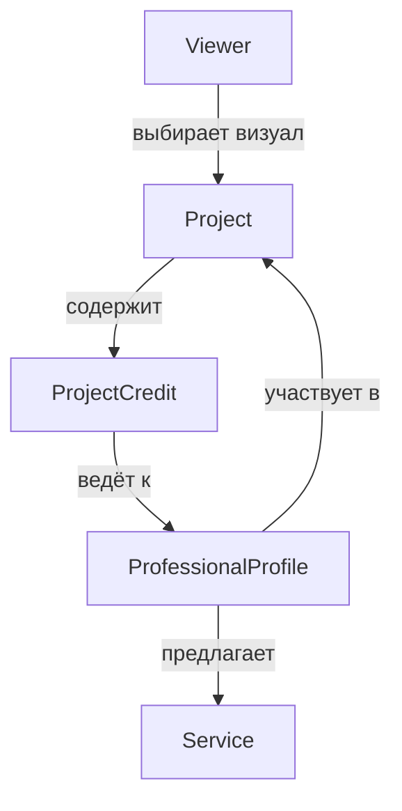

# Chereda — продуктовая основа и доменная логика

## 1. Продукт в одном абзаце

Chereda — визуальный поиск по event-индустрии. Пользователь находит понравившийся визуальный результат, открывает единый проект, видит всех реальных участников и их вклад, затем сравнивает профили по стилю, рейтингу, отзывам, цене, городу и готовности к выезду. Для профессионального поиска есть PRO-каталог с глубокими отраслевыми фильтрами.

## 2. Какая проблема решается

Сейчас один и тот же проект распадается на публикации фотографа, площадки, декоратора, стилиста и организатора. Авторство неполно, цены и география спрятаны, а клиенту приходится вручную восстанавливать состав команды.

Chereda хранит проект один раз и связывает его со всеми участниками. Это превращает изображение из вдохновения в рабочую точку входа к исполнителям.

## 3. Основные сущности

| Сущность | Значение | Главное правило |
|---|---|---|
| `Viewer` | пользователь demo | исследует, сохраняет, сравнивает, связывается |
| `ProfessionalProfile` | человек, команда, компания или площадка | имеет услуги, географию, цены, проекты, рейтинг |
| `Project` | опубликованный результат / кейс | единственная сущность; содержит медиа и всех участников |
| `ProjectCredit` | связь проекта и профиля | фиксирует роль, вклад, услуги и порядок показа |
| `Service` | конкретное предложение профиля | цена, единица, формат, территория работы |
| `Category` | отраслевое направление | определяет доступные фильтры |
| `Location` | город/регион и координаты demo | участвует в выдаче и маркировке близости |
| `Review` | оценка профиля | содержит рейтинг, текст, дату и проект-контекст |
| `RatingEntry` | позиция профиля в рейтинге | содержит score, место, динамику и breakdown |
| `Collection` | сохранённая подборка | содержит проекты; в будущем может содержать профили |
| `Notification` | событие для Viewer | ведёт на существующую сущность |
| `MediaAsset` | фото или видео | принадлежит проекту и имеет источник/alt |

## 4. Центральная связь

### 4.1. ProjectCredit обязателен

Нельзя хранить участников проекта простым массивом имён. Для каждого участника нужны:

- `profileId`;
- `roleLabel` — «фотограф», «декор», «укладка»;
- `categoryId` и при необходимости `subcategoryId`;
- `contribution` — что именно сделал участник;
- `serviceIds` — связанные услуги;
- `isLead` — главный организатор/автор при наличии;
- `creditOrder` — порядок показа;
- `confirmed` — подтверждён ли credit в demo.

Один профиль может иметь несколько ролей в одном проекте, но UI группирует их в одной карточке.

## 5. Что входит в команду проекта

Состав не ограничивается днём самого мероприятия. Для свадебного проекта demo должен уметь показывать:

- организатора и координатора;
- площадку;
- декор и флористику;
- фотографа и видеографа;
- ведущего и артистов;
- свет, звук и сцену;
- кейтеринг;
- транспорт;
- стилиста, визажиста и специалиста по причёске;
- ногтевой сервис;
- одежду, обувь и аксессуары;
- полиграфию, брендинг или сайт;
- безопасность, медицинское сопровождение и логистику, если они были частью проекта.

Показывать только реально заданных в seed участников, не генерировать роли на лету.

## 6. Типы профессиональных профилей

| Тип | Примеры | Особенности |
|---|---|---|
| `person` | фотограф, ведущий, стилист | имя/фамилия, личный avatar |
| `team` | кавер-группа, арт-команда | название, состав, общий avatar |
| `company` | агентство, декор-бюро, прокат | название, логотип/обложка, представители |
| `venue` | лофт, ресторан, концертная площадка | вместимость, адрес, инфраструктура, карта |

Тип не является категорией. Фотограф может быть `person` или `company`; площадка почти всегда `venue`.

## 7. География

### 7.1. Данные профиля

- основной город;
- регион/страна;
- список обслуживаемых городов;
- `travelMode`: `local-only`, `nearby`, `countrywide`, `international`, `remote`;
- максимальный радиус выезда, если применимо;
- доплата за выезд: включена, фиксирована, рассчитывается отдельно;
- remote-возможность для цифровых услуг.

### 7.2. Маркеры выдачи

| Marker | Значение |
|---|---|
| `В вашем городе` | основной город совпадает |
| `Рядом` | demo-distance в пределах выбранного радиуса |
| `Выезжает` | город другой, но профиль обслуживает выбранный регион |
| `По всей России` | `countrywide` |
| `По миру` | `international` |
| `Онлайн` | услуга доступна удалённо |

Если точные координаты не реализованы, не писать «2,4 км». Использовать честные дискретные маркеры.

### 7.3. Влияние на выдачу

1. Явно выбранный город — строгий контекст.
2. Профили из города идут выше при прочих равных.
3. Затем профили с подтверждённым выездом.
4. Remote допустим только для совместимых услуг.
5. Профили без географии не попадают в hero-results.

## 8. Цена

### 8.1. Форматы

- фиксированная цена;
- «от»;
- диапазон;
- за час;
- за человека;
- за смену;
- за проект;
- за единицу;
- по запросу.

### 8.2. Правила UI

- Цена всегда содержит валюту и единицу.
- «По запросу» — допустимое значение, не ошибка.
- В фильтрации сравнивать нормализованный `priceFrom`.
- Диапазон фильтра зависит от категории и demo-данных, а не от исходного универсального потолка 200 млн ₽.
- В карточке показывать одну основную цену; полный прайс — в профиле.
- Не обещать «итоговую стоимость», если дополнительные расходы не учтены.

## 9. Рейтинг и доверие

Рейтинг — объяснимый ориентир, не абсолютная оценка качества.

Demo-score: `0–99 999` и складывается из:

- среднего рейтинга и количества отзывов;
- подтверждённости профиля;
- заполненности профиля;
- количества и качества связанных проектов;
- свежести активности;
- сохранений и реакций;
- доли подтверждённых credits;
- штрафов за устаревшие данные.

Каждое значение score обязано иметь breakdown. Методика показана на странице рейтинга и в tooltip/popover.

## 10. Два режима поиска

### 10.1. Обычный discovery

Для человека, который начинает с визуального образа или простой потребности. Основные входы:

- изображение в ленте;
- тема или стиль;
- короткий запрос;
- город;
- рекомендации проекта.

### 10.2. PRO-каталог

Для точной отраслевой задачи. Основные входы:

- категория и подкатегория;
- город/выезд;
- бюджет и единица цены;
- отраслевые параметры;
- рейтинг, отзывы, верификация;
- наличие фото/видео/портфолио;
- сортировка и плотность выдачи.

PRO не требует другой роли в текущем demo.

## 11. Контактный сценарий

Кнопка «Связаться» открывает contact modal:

1. выбранный профиль;
2. контекст проекта, если переход выполнен из проекта;
3. выбранная услуга, если есть;
4. каналы связи demo;
5. короткая форма запроса;
6. подтверждение локальной «отправки»;
7. success notification.

Данные никуда не отправляются. После submit записывается локальное demo-событие и показывается подтверждение без ложного обещания реального ответа.

## 12. Рекомендации

В demo рекомендации детерминированы. Для каждого результата хранить `reason`:

- похожий стиль;
- тот же город;
- работали вместе;
- подходит к выбранной площадке;
- укладывается в бюджет;
- часто сохраняют вместе;
- дополняет отсутствующую роль команды.

Формулировка reason видима в UI. Нельзя писать «ИИ рекомендует», если экран не объясняет хотя бы один фактор.

## 13. Инварианты данных

- Project имеет минимум одно media и один credit.
- Hero-project имеет 8–14 media и 6–12 credits.
- Credit всегда ссылается на существующий профиль.
- Профиль содержит только существующие project IDs.
- Review с projectId ссылается на проект, где профиль был участником.
- RatingEntry ссылается на профиль той же категории и города рейтинга.
- Notification deep link существует.
- Collection item ссылается на существующий project.
- Media source внесён в manifest.
- Статистика карточки равна статистике detail page.

